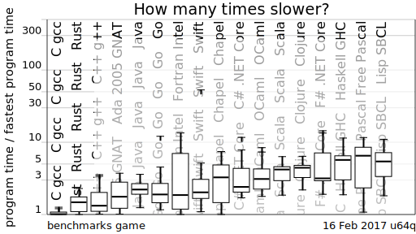
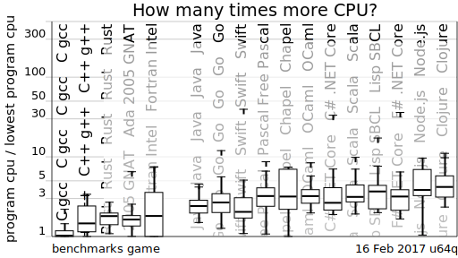
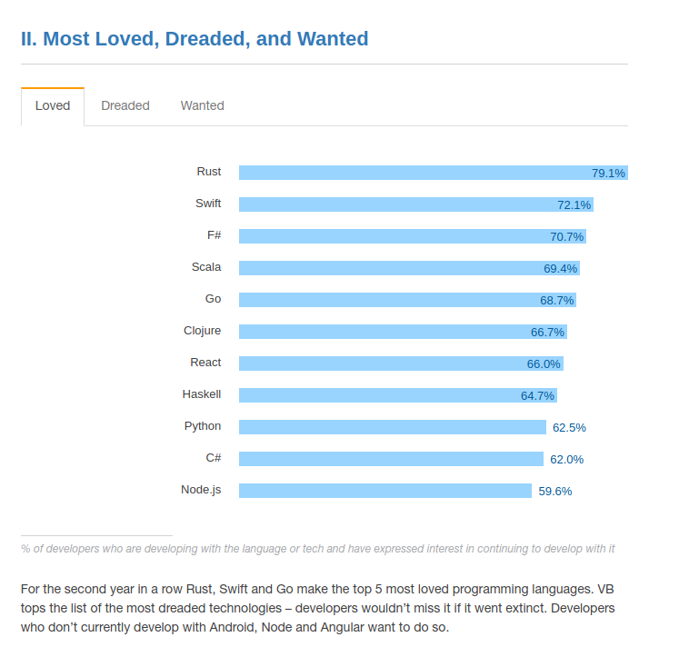

% Rust - So Familiar yet so Different


Alexander Torstling

# Poll

# Disclaimer

# Hello, World!

<script language="rust">
fn main() {
    println!("Hello, World!");
}
</script>

# Hello, Web!

<script language="rust">
extern crate iron;
extern crate router;
extern crate rustc_serialize;
use iron::prelude::*;
use iron::{status, Listening};
use router::Router;
use rustc_serialize::json;

fn server(port: &str) -> Listening {
    let mut router = Router::new();
    router.get("/yo/:phrase", get_yo, "get_yo");
    router.put("/yo",
               |_: &mut Request| Ok(Response::with((status::ImATeapot, "no"))),
               "put_yo");
    Iron::new(router).http(format!("localhost:{}", port)).unwrap()
}

#[derive(RustcEncodable)]
struct Answer {
    msg: String,
}

fn get_yo(req: &mut Request) -> IronResult<Response> {
    let phrase = req.extensions.get::<Router>().unwrap().find("phrase").unwrap();
    let ans = Answer { msg: format!("yo {}!", phrase).to_string() };
    let payload = json::encode(&ans).unwrap();
    Ok(Response::with((status::Ok, payload)))
}

fn main() {
    let _server = server("9999");
    println!("listening on port 9999");
    std::thread::park();
    panic!("spurious wakeup");
}
</script>

# Background

# Early Stages


* Started by Graydon Hoare 2006. OCaml
* Mozilla 2009
* Self-hosting compiler in 2010
* 1.0 in May of 2015 
* Now 1.15 (Mar 2017)

# Goals

* Find Alternative to C++ (at Mozilla)
  * Memory safety
  * Thread safety
  * Compilation model
  * Module system, dependencies

# Main Selling Points

* Memory safety without garbage collection (Novelish)
* Concurrency without data races (Novelish)
* Abstraction without overhead
* High-level language
* Low-level control - `unsafe`

# Usages

* Servo. Parallell Browser Rendering Engine by Mozilla
* Parts of Firefox
* Dropbox
* Npm
* Samsung (IoT)


# Language Properties

* System language
* Static, strong, inferred typing
* Compiled on LLVM
* Concurrent
* Imperative, Procedural
* Functional
  * First-class functions
  * Pattern matching
  * Ad-hoc polymorphism through Traits
  * Lambdas, Closures
  * Iterators (map, flatmap, filter etc)

# Language Properties 2

* OO-ish - visibility, Traits
* Generics
* Macros
* FFI - C, C++, interop
* `Cargo` complete solution for 
  * setting up projects
  * building 
  * formatting
  * testing
  * sharing code

# But

* No Real Reflection
* No Green Threads or Tasks

# Safety

* No wild pointers.
* No null pointers.
* Immutable by default.
* Pure by default
* Bounds-checked indexing
* Shared state is enforced to be threadsafe

# Compared to other Languages

# Speed



# CPU



# Basics

# Primitives

signed integers: `i8`, `i16`, `i32`, `i64` and `isize` (pointer size)

unsigned integers: `u8`, `u16`, `u32`, `u64` and `usize` (pointer size)

floating point: `f32`, `f64`

char Unicode scalar values like `'a'`, `'å'` and `'∞'` (4 bytes each)

bool either `true` or `false`

and the unit type `()`, whose only value is also `()`

arrays like `[1, 2, 3]`

tuples like `(1, true)`

# Variable bindings

<script language="rust">
fn main() {
  let a: u32 = 4711;
  println!("1: {}",a);

  let (b, c) = (42, 1337i32);
  println!("2: {}-{}", b, c);
}
</script>

# Prevent Read of Uninitialized

<script language="rust">
fn main() {
  let c: u32;
  // c = 15; // FIXME
  println!("{}", c);
}
</script>

# Mutability 1

The *binding* is mutable or not

<script language="rust">
fn main() {
  let a: u32 = 4711;  //FIXME
  a = 4712;
  println!("{}",a);
}
</script>

# Memory Safety without GC

How?

* Lifetimes
* Ownership
* Borrowing

# Ownership

* All data is either `static` or owned by some binding.
* There is only one owner of any given data.
* Ownership can be transfered - Move
* Sometimes data is copied instead -> Two pieces of data, two owners.
* When owner goes out of scope, data will be freed.

=> Automatic deallocation, no GC! 

# Lifetimes, Automatic Destruction

<script language="rust">
fn main() {
  let mut a = Vec::new();
  a.push(1);
  a.push(2);
}
</script>

# Copy

<script language="rust">
fn main() {
  let a = 4711;
  let b: u32 = a;
  println!("{}-{}", a, b);
}
</script>

# Move

* "Heavier" types
* Don't implement `Copy`

<script language="rust">
fn main() {
  let a = String::from("hej");
  let b: String = a;
  println!("{}", a); //FIXME
}
</script>

# References
* Views into data owned by someone else

## Types
* `&`
* `&mut`

## Rules
* A reference cannot outlive its referent

# Borrowing
Taking a reference "borrows" the data.
You can borrow for read or write. Still a borrow.

You can have EITHER

* one or more immutable references (&T) to a resource OR
* exactly one mutable reference (&mut T).

# Immutable References - Can Have Many

Can have many immutable references

-- Borrow immutably many times

<script language="rust">
fn main() {
  let a: u32 = 4711;
  let b: &u32 = &a;
  let c: &u32 = &a;
  println!("{:?}", (a,b,c));
}
</script>

# Immutable References - Mutate

You cannot mutate if borrowed. Even if only immutably borrowed

<script language="rust">
fn main() {
  let mut a: u32 = 4711;
  let b: &u32 = &a;
  a = 4712;
  println!("{:?}", (a,b));
}
</script>

# Mutable References 2

* Borrowing mutably "transfers access rights"

<script language="rust">
fn main() {
  let mut a: i64 = 4711;
  let b: &mut i64 = &mut a;
  let c = a; // FIXME
}
</script>

# Undo Mutability 

You cannot "undo" immutability

<script language="rust">
fn main() {
    let a: i32 = 47; // FIXME
    let b: &mut i32 = &mut a;
    *b = 48;
}
</script>

# References - Summary

* You can share variables through references
* Writing to a variable behaves like read/write locks
  * Write is exclusive
  * Read is concurrent

# Important Data Types and Constructs

# `str`

String constants are of type `str`.

`static` - part of the data segment of the executable.

Immutable. Have to refer to them by const reference

<script language="rust">
fn main() {
  let a: str = "hej"; //FIXME
  let b: &mut str = "på"; //FIXME
  let c: &str = "dig";
  println!("{}", c);
}
</script>

# `String`s

`String`s are mutable.

<script language="rust">
fn main() {
  let mut a: String = String::from("hej");
  a.push_str(" på dig");
  println!("{}", a);
}
</script>

# If Statement

<script language="rust">
fn main() {
  if 0 < 1 {
    println!("hej");
  }
}
</script>

# If Statement is Expression

<script language="rust">
fn main() {
  let x = if 1 > 0 { 4 } else { 5 };
  println!("{}", x);
}
</script>

# Loops

<script language="rust">
fn main() {
  let a = vec![1, 2, 3, 4];
  for i in a {
    if i % 2 == 0 {
      println!("{}", i);
    }
  }
}
</script>

# Functions

<script language="rust">
fn square(a: u32) -> u32 {
  a * a; // FIXME
}
fn main() {
  println!("{}", square(10));
}
</script>

# Functions Early Return

<script language="rust">
fn is_neg(a: i32) -> String {
  if a < 0 {
    return String::from("yes");
  }
  String::from("no")
}
fn main() {
  println!("{}", is_neg(0));
}
</script>

# Structs

<script language="rust">
#[derive(Debug)]
struct A {
  x: String,
  y: f64
}

fn main() {
  let a = A{ x: "hej".to_string(), y: 7.0 };
  println!("{:?}", a);
}
</script>

# Member Functions

<script language="rust">

struct Person { age: u32 }

impl Person {
  fn print(&self) {
    println!("A person aged {}", self.age);
  }
}
fn main() {
  Person { age: 14 }.print();
}
</script>


# Traits

* Interfaces, typeclasses
* Monomorphization

<script language="rust">
struct Person { age: u32 }

trait Printable {
  fn print(&self);
}

impl Printable for Person {
  fn print(&self) {
    println!("A person aged {}", self.age);
  }
}

impl Printable for u32 {
  fn print(&self) {
    println!("An int with value {}", self);
  }
}

fn main() {
  Person { age: 14 }.print();
  13.print();
}
</script>

# Closures

<script language="rust">
fn main() {
  let mut x = String::from("hej");
  {
    let mut append = | s: &str | { x.push_str(s); };
    append("san");
  }
  println!("{}", x);
}
</script>

# Generic Function Arguments

<script language="rust">
fn print<T: std::fmt::Display>(a: T, b: T) {
  println!("{}-{}", a, b);
}
fn print2<T>(a: T, b: T) 
  where T: std::fmt::Display + std::fmt::Debug
{
  println!("{}-{:?}", a, b);
}

fn main() {
  print("hej", 32); //FIXME
  print2("hej", "hej");
}
</script>


# First-class Functions and Closures

<script language="rust">
fn plus_one(a: u32) -> u32 {
  a + 1
}

fn do_twice(f: fn(u32) -> u32, i: u32) -> u32 {
  f(f(i))
}

fn do_twice_2<T: Fn(u32) -> u32>(f: T, i: u32) -> u32 {
  f(f(i))
}


fn main() {
  let _ref: fn(u32) -> u32 = plus_one;
  println!("{}", do_twice(plus_one, 1));
  println!("{}", do_twice_2(plus_one, 1));
  println!("{}", do_twice(| i | { i * 2 }, 4)); // FIXME
}
</script>

# Tuples

<script language="rust">
fn main() {
  let a : (&str, u32) = ("hej", 43);
  println!("{}{}", a.0, a.1);
}
</script>


# Back to Lifetimes and Ownership

# Lifetimes and Functions - Calling

* Move

<script language="rust">
fn gimme(_: String) {
}
fn main() {
  let a = String::from("a");
  {
    gimme(a); //FIXME
  }
  println!("{}", a);
}
</script>


# Lifetimes and Functions - Ref

* Borrow for the lifetime of call

<script language="rust">
fn gimme(_: &String) {
}
fn main() {
  let mut a = String::from("a");
  gimme(&a);
  gimme(&mut a);
  println!("{}", a);
}
</script>

# Lifetimes and Functions - Return

Functions must

* Declare how the lifetime of the return value
  relates to the lifetime of the in-parameters

<script language="rust">
fn unit(a: &str) -> &str {
  a
}
fn main() {
  let a = unit("hej");
  println!("{}", a);
}
</script>

# Lifetimes and Functions - Return

Functions must

* Declare how the lifetime of the return value
  relates to the lifetime of the in-parameters

<script language="rust">
fn unit<'a>(a: &'a str) -> &'a str {
  a
}
fn main() {
  let a = unit("hej");
  println!("{}", a);
}
</script>

# Lifetimes and Functions - Non-Automatic

<script language="rust">
struct Person { name: String }
fn get_first_name(p1: & Person, _: &Person) -> &String { //FIXME
  &p1.name
}
fn main() {
  let p1 = Person { name: "Arne".to_string() };
  let p2 = Person { name: "Ragnhild".to_string() };
  let name = get_first_name(&p1, &p2);
  println!("{}", name);
}
</script>

# Concurrency

# Threading - Basics

<script language="rust">
use std::thread;

fn main() {
  let ta = thread::spawn(|| { println!("in a"); "package from a" });
  println!("in main");
  println!("{}", ta.join().unwrap());
}
</script>

# Threading - Sharing Values

* Ref-Value
* Send

<script language="rust">
use std::thread;

fn main() {
  let i = 3;
  let ta = thread::spawn(|| { println!("a{}", i) }); // FIXME
  ta.join().unwrap();
}
</script>

# Threading - Mutable Values

* Scoping Problem - Crossbeam

<script language="rust">
use std::thread;

fn main() {
  let mut i = 3;
  let ta = thread::spawn(|| { i += 1 }); 
  println!("i: {}", i);
  //CANT-FIX
}
</script>


# Threading - Mutable Values

```
extern crate crossbeam;

fn main() {
  let mut i = 3;
  crossbeam::scope(|scope| {
    scope.spawn(|| { i += 1; });
    // ADD ONE
  });
  println!("i:{}", i);
}
```

# Threading - Mutex

```
extern crate crossbeam;
use std::sync::Mutex;

#[test]
fn mutate_in_threads() {
  let m = Mutex::new(3);
  crossbeam::scope(|scope| {
    scope.spawn(|| { 
      let mut lock = m.lock().unwrap();
      *lock += 1; 
    });
    scope.spawn(|| { 
      let mut lock = m.lock().unwrap();
      *lock += 1; 
    });
  });
  assert_eq!(*m.lock().unwrap(), 5);
}
```

# Threading - Conclusions

## Thread safety guaranteed by the compiler

## There is more
* Atomics
* Reference Counted
* Channels

# Build

## Demo

# More

# Arrays

<script language="rust">
fn main() {
  let xs: [i32; 5] = [0, 1, 2, 3, 4];
  let ys: [i32; 5] = [77; 5];
  println!("{:?}{:?}", xs, ys);
}
</script>

# Tuple Structs
<script language="rust">
#[test]
fn test() {
  #[derive(Debug)]
  struct Color(u32, u32, u32);
  let a = Color(1,2,3);
  assert_eq!(format!("{:?}", a), "Color(1, 2, 3)");
}
</script>

# Enums

Algebraic. A.k.a Case class, Data

<script language="rust">
#[derive(Debug)]
enum Animal {
  Horse { tail_length_mm: u32 },
  Moose(i32,u64),
  Duck { quackiness_dba: f64, diving: bool },
  Snake
}
fn main() {
  let (a, b) = (Animal::Snake, 
                Animal::Duck { quackiness_dba : 7.0, diving : false });
  let c: Animal = Animal::Moose(46,46);
  let d = Animal::Horse { tail_length_mm: 16 };
  println!("{:?}", (a, b, c, d));
}
</script>

# Match

<script language="rust">
fn main() {
  let x = 5;
  match x {
    1 | 2 => println!("small"),
    _ => println!("big")
  }
}
</script>

# Match Destructuring

<script language="rust">
enum Thing {
  Shoesize(u32),
  Coord { x: u32, y: u32 }
}

fn main() {
  let x: Thing = Thing::Coord { x: 13, y:47 };
  let _y = Thing::Shoesize(14);
  match x {
    Thing::Shoesize(s) => println!("shoesize {}", s),
    Thing::Coord { x, y } => println!("[{}, {}]", x, y)
  }
}
</script>

# Iterators

<script language="rust">
fn main() {
  let i = (1..10)
  .filter(|i| { i % 2 == 0 })
  .fold(0, | acc, i | { acc + i });
  println!("{}", i);
}
</script>

# Destructors

<script language="rust">

struct A {}

impl Drop for A {
  fn drop(&mut self) {
    println!("I am the weakest link, goodbye!");
  }
}

fn main() {
  {
    let _a = A{};
  }
  println!("Carry on!");
}
</script>

# Generic Structs 

<script language="rust">
struct Wrapped<T> {
  pub value: T
}

fn main() {
  let a = Wrapped{ value: "hej".to_string() };
  let mut b = Wrapped{ value: 7 };
  b = a; //FIXME
}
</script>

# Type Aliases

<script language="rust">
type Alex = String;
fn main() {
  let _a: Alex = String::from("Alex");
}
</script>

# Thank You




# Code Test

```rust
#[test]
fn test_it() {}
```

```rust
fn main() {}
```
# Left

x Deconstruction

x Everything is an expression

x Desctructors

x Safety

x No gc

x Borrow Checker

x Type inference

x Concurrency

x Generics

x Monomorphisation

x Closures

x Mut

x Structs

x Traits

x Memory safety without garbage collection

x Concurrency without data races

x Abstraction without overhead

Tests parallel by default

- Type aliases

# Phone Notes

x No gc latencies

x Destructors

x Safety

x No gc

x Borrow checker

x Type inference

x Concurrency

x Generics

x monomorphisation ni

x Mut

x Structs

x Traits

x Memory safety without garbage collection
Concurrency without data races

x Inga

x This post begins exploring the third pillar:

x Abstraction without overhead.

x "If" is an expr


x Mutable binding vs mutable reference

x let mut x = 4;

x let mut y = &mut x;

x x: MutBind -----> 0x0bc32: 4

x y: MutBind -----> mutBorrow ----> 0x0bc32: 4

First slide: http://venge.net/graydon/talks/intro-talk-2.pdf
