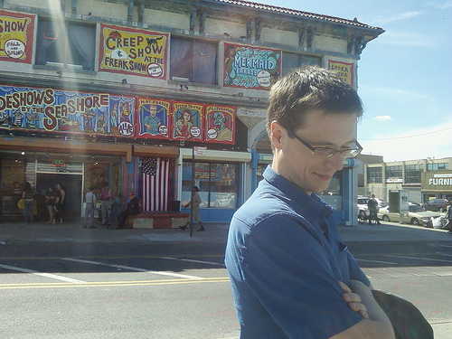

% Rust


Alexander Torstling

# Poll

# Hello, World!

<script language="rust">
fn main() {
    println!("Hello, World!");
}
</script>

# Hello, Web


# Background

# Early Stages



Graydon Hoare

# Yo


<script language="rust">
//This can be executed on Playpen
fn main() {
    println!("Hello, world!");
}
</script>

```rust
//This is display only code
fn main() {
    println!("Hello, World!");
}
```
